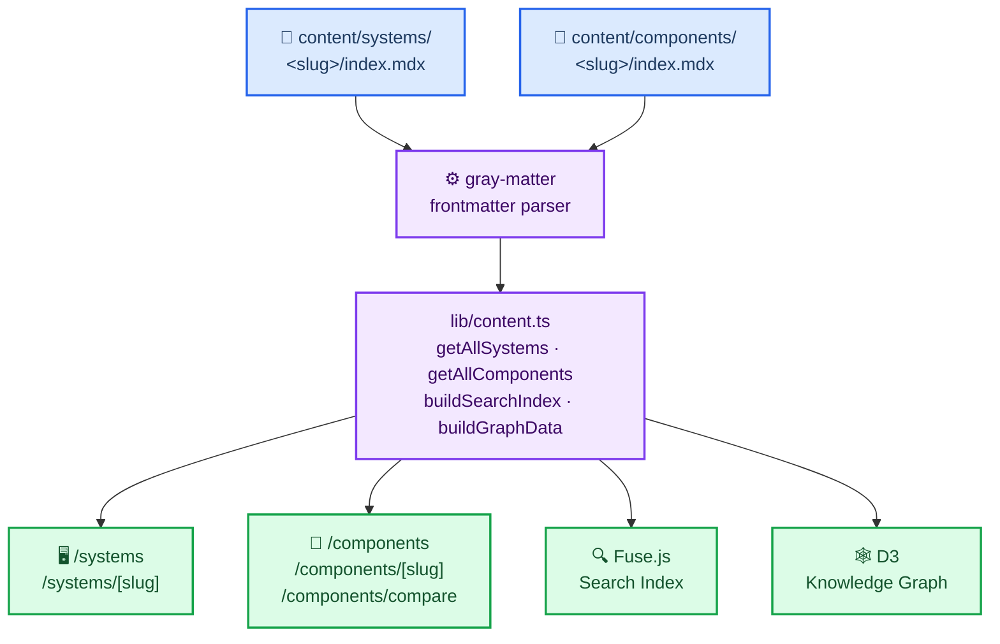
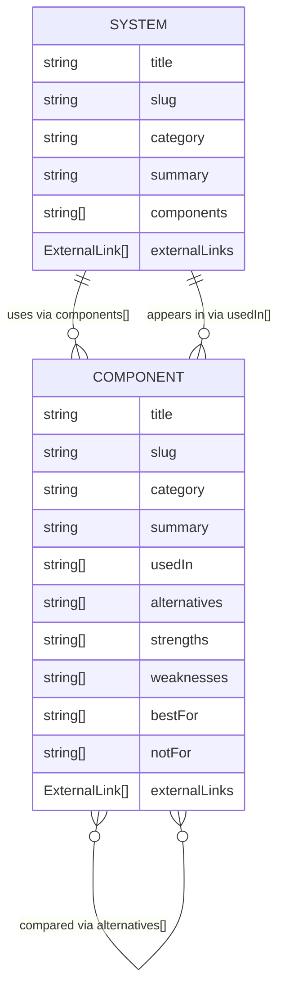
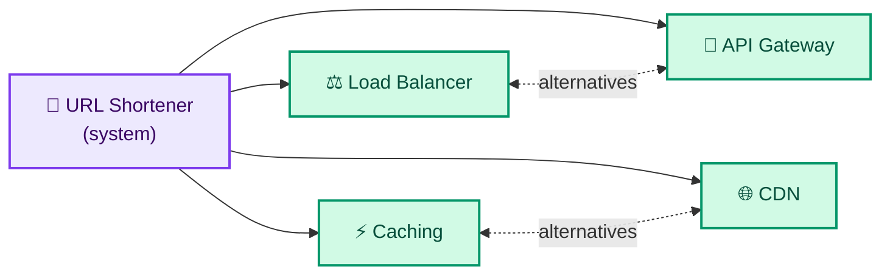
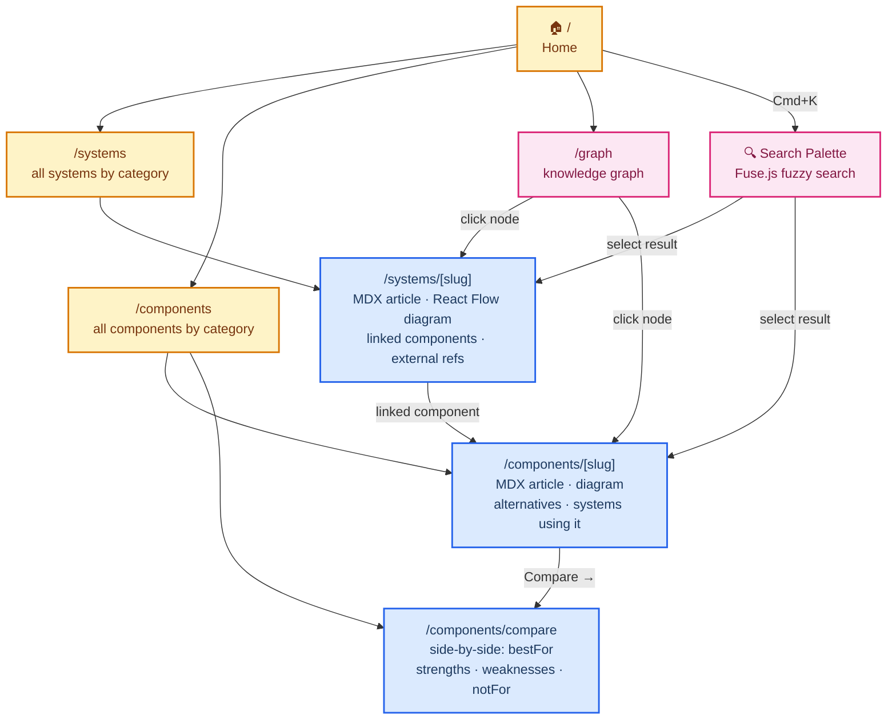

<div align="center">

# System Design

[](https://nextjs.org)
[](https://typescriptlang.org)
[](https://bun.sh)
[](https://tailwindcss.com)
[](https://react.dev)

*A knowledge-graph-powered platform for learning distributed system design.*
*Browse architectures, drill into building blocks, compare alternatives — all cross-linked and searchable.*

</div>

---

## Contents

- [System Design](#system-design)
  - [Contents](#contents)
  - [🚀 Quick Start](#-quick-start)
  - [✨ Features](#-features)
  - [🗺️ Architecture](#️-architecture)
  - [📦 Tech Stack](#-tech-stack)
  - [🧩 Content Model](#-content-model)
  - [🕸️ Knowledge Graph](#️-knowledge-graph)
  - [🧭 User Flows](#-user-flows)
  - [🗂️ Project Structure](#️-project-structure)
  - [➕ Adding Content](#-adding-content)
  - [📄 License](#-license)

---

## 🚀 Quick Start

```bash
bun install        # install dependencies
bun dev            # dev server at http://localhost:3000 (Turbopack)
bun build          # production build
bun start          # serve production build
bun lint           # ESLint via next lint
```

---

## ✨ Features

| Feature | Description |
|---|---|
| 📖 **System Deep-Dives** | Full MDX articles with interactive React Flow architecture diagrams |
| 🧩 **Component Library** | Reusable building blocks with strengths, weaknesses, and best-fit guidance |
| ⚖️ **Side-by-Side Compare** | Pick any two components and compare them across four structured dimensions |
| 🔍 **Cmd+K Search** | Fuzzy full-text search across all systems and components via Fuse.js |
| 🕸️ **Knowledge Graph** | D3 force-directed graph visualising every system↔component relationship |
| 🔗 **Bidirectional Links** | Systems list their components; components list the systems that use them |

---

## 🗺️ Architecture

> **Note:** All content is read from MDX files at build time — there is no database or CMS.



---

## 📦 Tech Stack

| Layer | Technology |
|---|---|
| **Framework & Language** | |
| Framework | Next.js 15 (App Router) |
| Language | TypeScript 5 |
| Package manager | Bun |
| **Styling & UI** | |
| Styling | Tailwind CSS v3 + `@tailwindcss/typography` |
| UI components | shadcn/ui (Radix UI primitives) |
| Icons | Lucide React |
| Fonts | Geist Sans + Geist Mono |
| **Content Pipeline** | |
| Content format | MDX via `next-mdx-remote/rsc` |
| Syntax highlighting | `rehype-pretty-code` + Shiki |
| Markdown extras | `remark-gfm` |
| Frontmatter parsing | `gray-matter` |
| **Data, Search & Visualization** | |
| Search | Fuse.js (client-side fuzzy search) |
| Search state | Zustand |
| Interactive diagrams | React Flow (`@xyflow/react`) |
| Knowledge graph | D3.js v7 (force-directed) |

---

## 🧩 Content Model

Systems and components are bidirectionally linked through frontmatter. A system declares the components it uses; each component declares which systems use it and what its alternatives are. The comparison fields (`strengths`, `weaknesses`, `bestFor`, `notFor`) power the `/components/compare` page.



<details>
<summary><strong>System frontmatter</strong></summary>

```yaml
title: "URL Shortener"
slug: "url-shortener"
category: "system"        # storage | messaging | compute | System | coordination | observability
summary: "One-line description"
components:
  - "load-balancer"
  - "caching"
externalLinks:
  - label: "Link text"
    url: "https://..."
```

</details>

<details>
<summary><strong>Component frontmatter</strong></summary>

```yaml
title: "Caching"
slug: "caching"
category: "storage"
summary: "One-line description"
usedIn:
  - "url-shortener"
alternatives:
  - "cdn"
strengths:
  - "Sub-millisecond read latency for hot data"
weaknesses:
  - "Cache invalidation is hard to get right"
bestFor:
  - "Database query result caching"
notFor:
  - "Large binary files (images, videos)"
externalLinks:
  - label: "Link text"
    url: "https://..."
```

</details>

---

## 🕸️ Knowledge Graph

Every system and component becomes a node. Edges flow from system → component, forming a navigable web of relationships visible at `/graph`. The live graph supports drag-to-reposition, scroll/pinch to zoom, and click-to-navigate.



---

## 🧭 User Flows



---

## 🗂️ Project Structure

```
app/                          # Next.js App Router pages
  page.tsx                    # Home / landing
  systems/
    page.tsx                  # Systems listing
    [slug]/page.tsx           # System detail (MDX + diagram)
  components/
    page.tsx                  # Components listing
    [slug]/page.tsx           # Component detail (MDX + diagram)
    compare/page.tsx          # Side-by-side component comparison
  graph/
    page.tsx                  # Knowledge graph

content/
  systems/<slug>/index.mdx   # One MDX file per system
  components/<slug>/index.mdx # One MDX file per component

components/
  layout/
    header.tsx                # Sticky nav header
  shared/
    search-command.tsx        # Cmd+K command palette (Fuse.js)
    mdx-content.tsx           # MDX renderer
    category-badge.tsx        # Coloured category tag
    content-card.tsx          # Card for listing pages
    comparison-table.tsx      # Side-by-side comparison rows
    compare-selector.tsx      # Dropdown pair → compare URL
  visualizations/
    load-balancer-diagram.tsx # React Flow round-robin animation
    cache-diagram.tsx         # React Flow hit/miss demo
    url-shortener-diagram.tsx # React Flow architecture diagram
    knowledge-graph.tsx       # D3 force-directed knowledge graph

lib/
  content.ts                  # MDX loaders, search index, graph data builders
  search-store.ts             # Zustand store for search palette open state
  utils.ts                    # cn() Tailwind class utility

types/
  index.ts                    # SystemMeta, ComponentMeta, ExternalLink, GraphNode, GraphEdge
```

---

## ➕ Adding Content

Categories: `storage` · `messaging` · `compute` · `system` · `coordination` · `observability`

<details>
<summary><strong>Add a new system</strong></summary>

1. Create `content/systems/<slug>/index.mdx` with the System frontmatter above.
2. List the component slugs it uses under `components:`.
3. Add the system's slug to `usedIn:` in each referenced component's frontmatter.
4. The system appears automatically on `/systems`, `/systems/[slug]`, search, and the knowledge graph.

</details>

<details>
<summary><strong>Add a new component</strong></summary>

1. Create `content/components/<slug>/index.mdx` with the Component frontmatter above.
2. Add the component's slug to `components:` in any system that uses it.
3. Optionally create a React Flow diagram in `components/visualizations/` and register it in `app/components/[slug]/page.tsx`.
4. The component appears automatically on `/components`, `/components/[slug]`, search, compare, and the graph.

</details>

---

## 📄 License

MIT — see [LICENSE](LICENSE)
